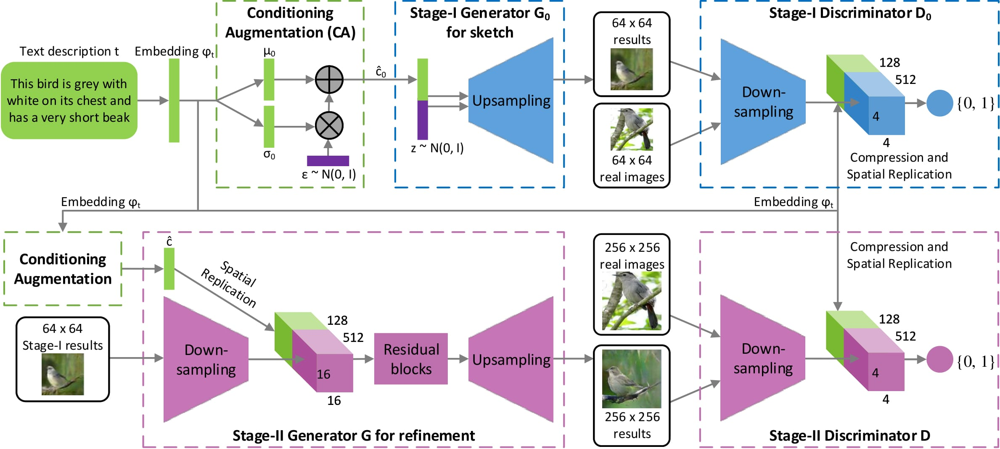
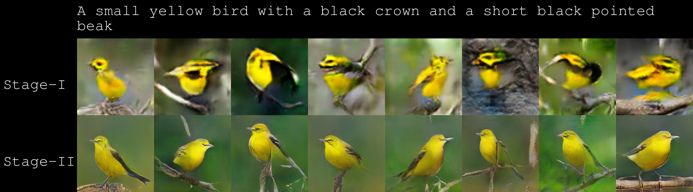
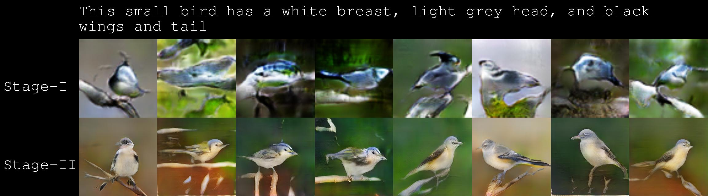
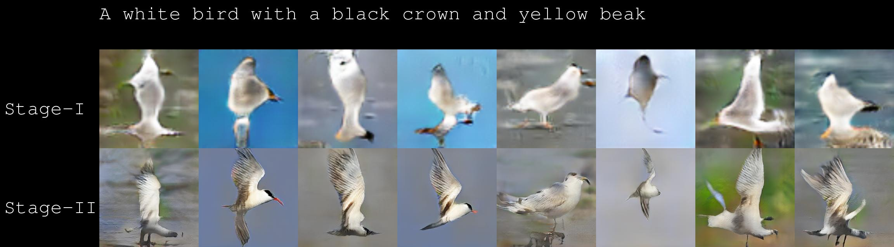
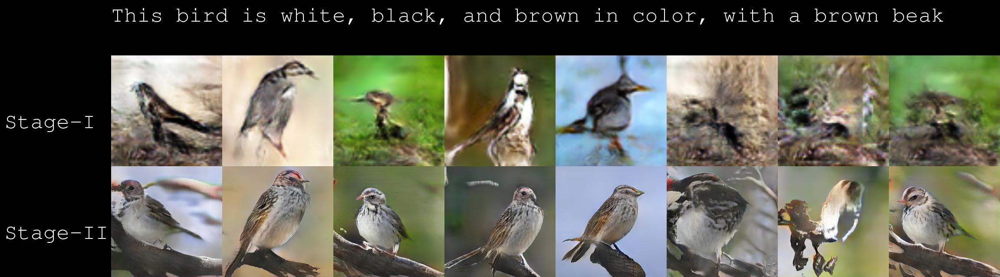
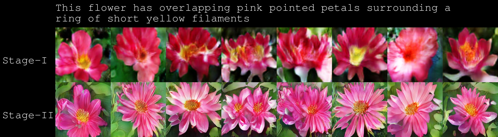
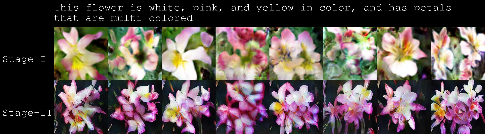
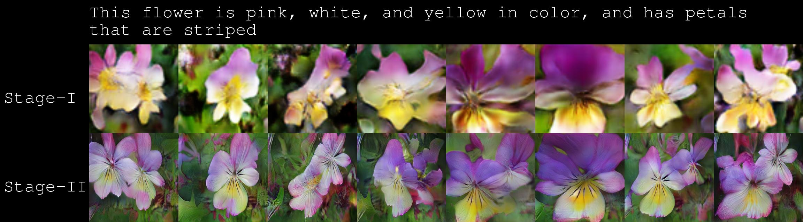

# StackGAN
- [Pytorch implementation](https://github.com/hanzhanggit/StackGAN-Pytorch)

- [Inception score evaluation](https://github.com/hanzhanggit/StackGAN-inception-model)

- [StackGAN-v2-pytorch](https://github.com/hanzhanggit/StackGAN-v2)

Tensorflow implementation for reproducing main results in the paper [StackGAN: Text to Photo-realistic Image Synthesis with Stacked Generative Adversarial Networks](https://arxiv.org/pdf/1612.03242v2.pdf) by Han Zhang, Tao Xu, Hongsheng Li, Shaoting Zhang, Xiaogang Wang,   Xiaolei Huang, Dimitris Metaxas.




### Dependencies
python 2.7

[TensorFlow 0.12](https://www.tensorflow.org/get_started/os_setup)

[Optional] [Torch](http://torch.ch/docs/getting-started.html#_) is needed, if use the pre-trained char-CNN-RNN text encoder.

[Optional] [skip-thought](https://github.com/ryankiros/skip-thoughts) is needed, if use the skip-thought text encoder.

In addition, please add the project folder to PYTHONPATH and `pip install` the following packages:
- `prettytensor`
- `progressbar`
- `python-dateutil`
- `easydict`
- `pandas`
- `torchfile`


**Data**

1. Download our preprocessed char-CNN-RNN text embeddings for [birds](https://drive.google.com/open?id=0B3y_msrWZaXLT1BZdVdycDY5TEE) and [flowers](https://drive.google.com/open?id=0B3y_msrWZaXLaUc0UXpmcnhaVmM) and save them to `Data/`.
  - [Optional] Follow the instructions [reedscot/icml2016](https://github.com/reedscot/icml2016) to download the pretrained char-CNN-RNN text encoders and extract text embeddings.
2. Download the [birds](http://www.vision.caltech.edu/visipedia/CUB-200-2011.html) and [flowers](http://www.robots.ox.ac.uk/~vgg/data/flowers/102/) image data. Extract them to `Data/birds/` and `Data/flowers/`, respectively.
3. Preprocess images.
  - For birds: `python misc/preprocess_birds.py`
  - For flowers: `python misc/preprocess_flowers.py`


**Training**
- The steps to train a StackGAN model on the CUB dataset using our preprocessed data for birds.
  - Step 1: train Stage-I GAN (e.g., for 600 epochs) `python stageI/run_exp.py --cfg stageI/cfg/birds.yml --gpu 0`
  - Step 2: train Stage-II GAN (e.g., for another 600 epochs) `python stageII/run_exp.py --cfg stageII/cfg/birds.yml --gpu 1`
- Change `birds.yml` to `flowers.yml` to train a StackGAN model on Oxford-102 dataset using our preprocessed data for flowers.
- `*.yml` files are example configuration files for training/testing our models.
- If you want to try your own datasets, [here](https://github.com/soumith/ganhacks) are some good tips about how to train GAN. Also, we encourage to try different hyper-parameters and architectures, especially for more complex datasets.


**Pretrained Model**
- [StackGAN for birds](https://drive.google.com/open?id=0B3y_msrWZaXLNUNKa3BaRjAyTzQ) trained from char-CNN-RNN text embeddings. Download and save it to `models/`.
- [StackGAN for flowers](https://drive.google.com/open?id=0B3y_msrWZaXLX01FMC1JQW9vaFk) trained from char-CNN-RNN text embeddings. Download and save it to `models/`.
- [StackGAN for birds](https://drive.google.com/open?id=0B3y_msrWZaXLZVNRNFg4d055Q1E) trained from skip-thought text embeddings. Download and save it to `models/` (Just used the same setting as the char-CNN-RNN. We assume better results can be achieved by playing with the hyper-parameters).


**Run Demos**
- Run `sh demo/flowers_demo.sh` to generate flower samples from sentences. The results will be saved to `Data/flowers/example_captions/`. (Need to [download](https://drive.google.com/file/d/0B0ywwgffWnLLZUt0UmQ1LU1oWlU/view) the char-CNN-RNN text encoder for flowers to `models/text_encoder/`. Note: this text encoder is provided by [reedscot/icml2016](https://github.com/reedscot/icml2016)).
- Run `sh demo/birds_demo.sh` to generate bird samples from sentences. The results will be saved to `Data/birds/example_captions/`.(Need to [download](https://drive.google.com/file/d/0B0ywwgffWnLLU0F3UHA3NzFTNEE/view) the char-CNN-RNN text encoder for birds to `models/text_encoder/`. Note: this text encoder is provided by [reedscot/icml2016](https://github.com/reedscot/icml2016)).
- Run `python demo/birds_skip_thought_demo.py --cfg demo/cfg/birds-skip-thought-demo.yml --gpu 2` to generate bird samples from sentences. The results will be saved to `Data/birds/example_captions-skip-thought/`. (Need to [download](https://github.com/ryankiros/skip-thoughts) vocabulary for skip-thought vectors to `Data/skipthoughts/`).

Examples for birds (char-CNN-RNN embeddings), more on [youtube](https://youtu.be/93yaf_kE0Fg):






Examples for flowers (char-CNN-RNN embeddings), more on [youtube](https://youtu.be/SuRyL5vhCIM):





Save your favorite pictures generated by our models since the randomness from noise z and conditioning augmentation makes them creative enough to generate objects with different poses and viewpoints from the same discription :smiley:


### Citing StackGAN
If you find StackGAN useful in your research, please consider citing:

```
@inproceedings{han2017stackgan,
Author = {Han Zhang and Tao Xu and Hongsheng Li and Shaoting Zhang and Xiaogang Wang and Xiaolei Huang and Dimitris Metaxas},
Title = {StackGAN: Text to Photo-realistic Image Synthesis with Stacked Generative Adversarial Networks},
Year = {2017},
booktitle = {{ICCV}},
}
```

**Our follow-up work**

- [StackGAN++: Realistic Image Synthesis with Stacked Generative Adversarial Networks](https://arxiv.org/abs/1710.10916)
- [AttnGAN: Fine-Grained Text to Image Generation with Attentional Generative Adversarial Networks](https://arxiv.org/abs/1711.10485) [[supplementary]](https://1drv.ms/b/s!Aj4exx_cRA4ghK5-kUG-EqH7hgknUA)

**References**

- Generative Adversarial Text-to-Image Synthesis [Paper](https://arxiv.org/abs/1605.05396) [Code](https://github.com/reedscot/icml2016)
- Learning Deep Representations of Fine-grained Visual Descriptions [Paper](https://arxiv.org/abs/1605.05395) [Code](https://github.com/reedscot/cvpr2016)
